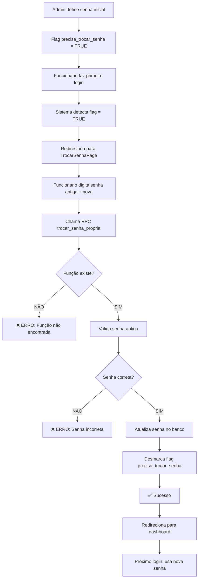

# 🔐 Correção: Senha Trocada mas Login com Senha Antiga

## 🐛 Problema Identificado

**Sintoma**: Funcionário troca a senha, mas ao fazer login novamente, o sistema continua pedindo para trocar a senha e **aceita a senha ANTIGA** ao invés da nova.

## 🔍 Causa Raiz

A função `trocar_senha_propria` **NÃO EXISTE** no banco de dados do Supabase, resultando em:

1. ❌ Senha não é atualizada no banco
2. ❌ Flag `precisa_trocar_senha` não é desmarcada
3. ❌ Funcionário fica preso em loop de troca de senha
4. ❌ Frontend mostra "sucesso" mas nada acontece no banco

### Evidência nos Logs

```javascript
TrocarSenhaPage.tsx:58  ❌ Erro ao trocar senha: {
  code: 'PGRST202', 
  message: 'Could not find the function public.trocar_senha_propria...'
}
```

Porém, **depois** a mensagem de sucesso aparece (bug no tratamento de erro):
```javascript
TrocarSenhaPage.tsx:72 ✅ Senha trocada com sucesso!
```

## ✅ Solução

### Passo 1: Executar SQL no Supabase

Execute o arquivo **`CORRIGIR_TROCAR_SENHA_PROPRIA_FINAL.sql`** no Supabase SQL Editor:

1. Acesse o Supabase Dashboard
2. Vá em **SQL Editor**
3. Cole o conteúdo do arquivo `CORRIGIR_TROCAR_SENHA_PROPRIA_FINAL.sql`
4. Clique em **RUN**

Este SQL irá:
- ✅ Remover versões antigas da função
- ✅ Criar a função `trocar_senha_propria` correta
- ✅ Garantir que a flag `precisa_trocar_senha` seja desmarcada
- ✅ Adicionar logs para debug
- ✅ Validar senha antiga antes de atualizar

### Passo 2: Testar no Sistema

1. **Fazer logout** (se estiver logado)
2. **Login com email da empresa** (ex: `assistenciaallimport10@gmail.com`)
3. **Selecionar o funcionário** Jennifer Sousa
4. **Digitar senha antiga** (a que você definiu no admin)
5. **Trocar para nova senha** (ex: `novaSenha2025`)
6. **Fazer logout**
7. **Login novamente** com Jennifer e a **NOVA senha**
8. ✅ **Não deve pedir para trocar senha novamente**

## 🔑 Estrutura Correta da Função

```sql
CREATE OR REPLACE FUNCTION public.trocar_senha_propria(
    p_funcionario_id UUID,
    p_senha_antiga TEXT,
    p_senha_nova TEXT
)
RETURNS JSON
-- ... (veja o arquivo SQL completo)
AS $$
BEGIN
    -- Valida senha antiga
    v_senha_valida := (v_login.senha = crypt(p_senha_antiga, v_login.senha));
    
    -- Atualiza senha E desmarca flag
    UPDATE public.login_funcionarios
    SET 
        senha = crypt(p_senha_nova, gen_salt('bf')),
        precisa_trocar_senha = FALSE,  -- 🔥 CRUCIAL
        updated_at = NOW()
    WHERE funcionario_id = p_funcionario_id;
    
    RETURN json_build_object('success', true, ...);
END;
$$;
```

## 🧪 Como Verificar se Funcionou

### No Supabase SQL Editor:

```sql
-- Ver funcionários que precisam trocar senha
SELECT 
    f.nome,
    lf.usuario,
    lf.precisa_trocar_senha,
    lf.updated_at
FROM public.funcionarios f
INNER JOIN public.login_funcionarios lf ON lf.funcionario_id = f.id
WHERE lf.ativo = TRUE
ORDER BY f.nome;
```

**Resultado esperado após troca de senha**:
- `precisa_trocar_senha` = `FALSE`
- `updated_at` = timestamp recente

## 📊 Fluxo Correto de Troca de Senha



## 🔧 Correção no Frontend (Opcional)

Para melhorar o tratamento de erro em `TrocarSenhaPage.tsx`:

```typescript
const { error } = await supabase.rpc('trocar_senha_propria', {
  p_funcionario_id: state.funcionarioId,
  p_senha_antiga: senhaAtual,
  p_senha_nova: novaSenha
});

if (error) {
  console.error('❌ Erro ao trocar senha:', error);
  
  // Tratamento específico por tipo de erro
  if (error.code === 'PGRST202') {
    toast.error('❌ Função de troca de senha não encontrada. Contate o administrador.');
  } else if (error.message.includes('Senha antiga incorreta')) {
    toast.error('❌ Senha atual incorreta');
  } else if (error.message.includes('6 caracteres')) {
    toast.error('❌ A nova senha deve ter pelo menos 6 caracteres');
  } else {
    toast.error('❌ Erro: ' + error.message);
  }
  
  setLoading(false);
  return; // 🔥 PARE AQUI - não mostre sucesso!
}

// Só chega aqui se NÃO houver erro
console.log('✅ Senha trocada com sucesso!');
toast.success('✅ Senha alterada com sucesso!');
```

## 📞 Suporte

Se o problema persistir após executar o SQL:

1. Verifique se a função foi criada:
   ```sql
   SELECT routine_name FROM information_schema.routines
   WHERE routine_name = 'trocar_senha_propria';
   ```

2. Verifique os logs do Supabase (aba "Logs")

3. Teste manualmente no SQL Editor:
   ```sql
   SELECT * FROM public.trocar_senha_propria(
       'id-do-funcionario'::UUID,
       'senhaAtual',
       'novaSenha'
   );
   ```

---

**Última atualização**: 2025-12-07  
**Versão do sistema**: 2.2.7-stable
