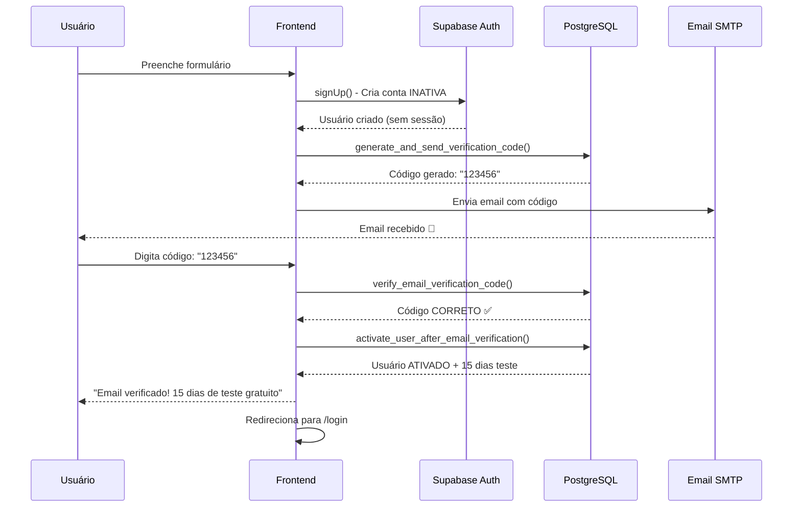

# 📧 Sistema de Verificação de Email Customizado

## 📋 Visão Geral

Sistema próprio de verificação de email que garante que **apenas usuários com email verificado possam acessar o sistema**, com concessão automática de **15 dias de teste gratuito**.

---

## 🎯 Objetivos

1. ✅ **Segurança**: Email só ativa após verificação correta do código
2. ✅ **Controle**: Usuário não pode fazer login sem verificar email
3. ✅ **Teste Gratuito**: 15 dias automáticos após verificação
4. ✅ **Proteção**: Limite de tentativas e expiração de código
5. ✅ **Independência**: Sistema próprio, não depende do Supabase Auth OTP

---

## 🏗️ Arquitetura

### **1. Banco de Dados (PostgreSQL/Supabase)**

#### Tabela: `email_verification_codes`

```sql
CREATE TABLE public.email_verification_codes (
  id UUID PRIMARY KEY DEFAULT gen_random_uuid(),
  email VARCHAR(255) NOT NULL,
  code VARCHAR(6) NOT NULL,
  expires_at TIMESTAMPTZ NOT NULL DEFAULT (NOW() + INTERVAL '15 minutes'),
  attempts INTEGER DEFAULT 0,
  max_attempts INTEGER DEFAULT 5,
  verified BOOLEAN DEFAULT FALSE,
  created_at TIMESTAMPTZ DEFAULT NOW(),
  updated_at TIMESTAMPTZ DEFAULT NOW()
);
```

**Características:**
- Código de 6 dígitos numéricos
- Expira em **15 minutos**
- Máximo de **5 tentativas**
- Um código por email (códigos antigos são invalidados)

---

### **2. Funções SQL**

#### `generate_and_send_verification_code(user_email TEXT)`

**O que faz:**
- Gera código aleatório de 6 dígitos
- Invalida códigos antigos do mesmo email
- Insere novo código no banco
- Retorna código para ser enviado por email

**Retorno:**
```json
{
  "success": true,
  "code": "123456",
  "code_id": "uuid",
  "expires_in_minutes": 15
}
```

---

#### `verify_email_verification_code(user_email TEXT, user_code TEXT)`

**O que faz:**
- Busca código mais recente não verificado
- Verifica se está expirado
- Verifica número de tentativas
- Compara código fornecido com código armazenado
- Marca como verificado se correto

**Retorno (sucesso):**
```json
{
  "success": true,
  "message": "Código verificado com sucesso!"
}
```

**Retorno (erro):**
```json
{
  "success": false,
  "error": "Código inválido",
  "attempts_remaining": 3
}
```

---

#### `activate_user_after_email_verification(user_email TEXT)`

**O que faz:**
- Marca email como verificado
- Cria/atualiza registro na tabela `subscriptions`
- Define status como `trial` (período de teste)
- Configura data de fim: **NOW() + 15 dias**

**Retorno:**
```json
{
  "success": true,
  "message": "Email verificado e período de teste ativado!",
  "subscription": {
    "id": "uuid",
    "email": "user@example.com",
    "status": "trial",
    "trial_end_date": "2025-10-27T20:00:00Z",
    "days_remaining": 15
  }
}
```

---

### **3. Serviços TypeScript**

#### `src/services/customEmailVerification.ts`

**Funções principais:**

##### `sendVerificationCode(email: string)`
```typescript
// 1. Gera código no banco via RPC
// 2. Obtém código gerado
// 3. Envia email com código via Supabase SMTP
// 4. Retorna sucesso (sem expor código)

const result = await sendVerificationCode('user@example.com');
// { success: true, message: "Código enviado..." }
```

##### `verifyCode(email: string, code: string)`
```typescript
// 1. Valida código no banco via RPC
// 2. Se correto: chama ativação de usuário
// 3. Retorna resultado com info de teste gratuito

const result = await verifyCode('user@example.com', '123456');
// { 
//   success: true, 
//   message: "Email verificado!",
//   trialEndDate: "2025-10-27",
//   daysRemaining: 15
// }
```

##### `resendVerificationCode(email: string)`
```typescript
// Wrapper para sendVerificationCode
// Gera novo código e envia
```

---

#### `src/services/userActivationService.ts`

**Função principal:**

##### `activateUserAfterEmailVerification(email: string)`
```typescript
// Chama função SQL activate_user_after_email_verification
// Retorna informações do período de teste

const result = await activateUserAfterEmailVerification('user@example.com');
// {
//   success: true,
//   message: "Usuário ativado!",
//   trialEndDate: "2025-10-27",
//   daysRemaining: 15
// }
```

---

### **4. Frontend (React)**

#### `src/modules/auth/SignupPageNew.tsx`

**Fluxo completo:**

```typescript
// 1. Usuário preenche formulário
const handleSubmit = async () => {
  // Criar conta no Supabase Auth (INATIVA)
  const result = await signUp(formData);
  
  // Enviar código de verificação
  const emailResult = await sendVerificationCode(formData.email);
  
  // Mudar para tela de verificação
  setStep('verify');
}

// 2. Usuário digita código de 6 dígitos
const handleVerify = async (fullCode: string) => {
  // Verificar código
  const result = await verifyCode(email, fullCode);
  
  if (result.success) {
    // Mostrar mensagem de sucesso + dias de teste
    setSuccessMessage(`✅ Você ganhou ${result.daysRemaining} dias de teste!`);
    
    // Redirecionar para login após 2.5s
    setTimeout(() => navigate('/login'), 2500);
  } else {
    // Mostrar erro + tentativas restantes
    setError(`${result.error} (${result.attemptsRemaining} tentativas)`);
  }
}

// 3. Reenviar código (se necessário)
const handleResend = async () => {
  await resendVerificationCode(email);
  setSuccessMessage('✅ Novo código enviado!');
}
```

---

## 🔄 Fluxo Completo

### **Cadastro e Verificação**



---

## 🔒 Segurança

### **Proteções Implementadas**

1. **Limite de Tentativas**
   - Máximo 5 tentativas por código
   - Após 5 tentativas: código invalidado, necessário solicitar novo

2. **Expiração de Código**
   - Código válido por apenas **15 minutos**
   - Códigos expirados não podem ser usados

3. **Um Código por Vez**
   - Ao gerar novo código, códigos antigos são invalidados
   - Previne confusão com múltiplos códigos

4. **Sem Sessão Antes da Verificação**
   - Usuário não consegue fazer login sem verificar email
   - `email_verified = FALSE` até verificação

5. **Código Não Exposto**
   - Código nunca é retornado ao frontend
   - Apenas enviado por email
   - Logs mostram código apenas em desenvolvimento

---

## 📊 Estados do Usuário

### **Tabela `subscriptions`**

| Campo | Valor Inicial | Após Verificação |
|-------|--------------|------------------|
| `email_verified` | `FALSE` | `TRUE` |
| `status` | `NULL` ou `inactive` | `trial` |
| `subscription_start_date` | `NULL` | `NOW()` |
| `subscription_end_date` | `NULL` | `NOW() + 15 days` |

---

## 🧪 Testando o Sistema

### **1. Criar SQL no Supabase**

Execute os arquivos na ordem:

```bash
# 1. Criar tabela e funções de verificação
migrations/create-custom-email-verification-system.sql

# 2. Criar função de ativação
migrations/activate-user-after-email-verification.sql
```

### **2. Testar Geração de Código**

```sql
-- Gerar código para teste
SELECT generate_and_send_verification_code('teste@exemplo.com');

-- Ver código gerado
SELECT * FROM email_verification_codes 
WHERE email = 'teste@exemplo.com' 
ORDER BY created_at DESC 
LIMIT 1;
```

### **3. Testar Verificação**

```sql
-- Verificar código (substitua pelo código gerado)
SELECT verify_email_verification_code('teste@exemplo.com', '123456');

-- Verificar ativação
SELECT activate_user_after_email_verification('teste@exemplo.com');

-- Ver assinatura criada
SELECT * FROM subscriptions WHERE email = 'teste@exemplo.com';
```

---

## 🐛 Troubleshooting

### **Problema: Código não chega por email**

**Solução:**
1. Verificar SMTP configurado no Supabase
2. Verificar pasta de spam
3. Ver logs no console do navegador
4. Verificar se função SQL foi executada:
   ```sql
   SELECT * FROM email_verification_codes 
   WHERE email = 'seu-email@exemplo.com';
   ```

### **Problema: "Código inválido" mas código está correto**

**Solução:**
1. Verificar se código não expirou (15 minutos)
2. Verificar tentativas restantes
3. Solicitar novo código
4. Verificar no banco:
   ```sql
   SELECT code, expires_at, attempts, verified
   FROM email_verification_codes
   WHERE email = 'seu-email@exemplo.com'
   ORDER BY created_at DESC
   LIMIT 1;
   ```

### **Problema: Usuário ativado sem verificar código**

**Verificação:**
```sql
-- Ver status do usuário
SELECT 
  email,
  email_verified,
  status,
  subscription_start_date,
  subscription_end_date
FROM subscriptions
WHERE email = 'seu-email@exemplo.com';

-- Deve mostrar email_verified = TRUE apenas após verificação
```

---

## 📝 Logs e Monitoramento

### **Console do Navegador**

```javascript
// Ao enviar código
📧 Gerando código de verificação para: user@example.com
🔐 Código gerado: 123456
✅ Código gerado e email enviado!

// Ao verificar código
🔍 Verificando código para: user@example.com
✅ Código verificado com sucesso!
🎯 Ativando usuário e concedendo período de teste...
🎉 Usuário ativado com sucesso!
```

### **Supabase Logs**

```sql
-- Ver códigos gerados
SELECT 
  email,
  code,
  created_at,
  expires_at,
  attempts,
  verified
FROM email_verification_codes
WHERE created_at > NOW() - INTERVAL '1 hour'
ORDER BY created_at DESC;

-- Ver ativações
SELECT 
  email,
  status,
  subscription_start_date,
  subscription_end_date,
  email_verified
FROM subscriptions
WHERE updated_at > NOW() - INTERVAL '1 hour'
ORDER BY updated_at DESC;
```

---

## 🚀 Deploy

### **Checklist**

- [x] SQL executado no Supabase
- [x] Funções SQL criadas e com permissões
- [x] SMTP configurado no Supabase
- [x] Código frontend atualizado
- [x] Build executado sem erros
- [x] Commit e push para GitHub
- [x] Deploy automático no Vercel

### **Verificar em Produção**

1. Acessar URL de produção
2. Ir para página de cadastro
3. Criar conta com email real
4. Verificar recebimento do código
5. Testar verificação
6. Confirmar login funcionando

---

## 📚 Referências

- **Arquivos SQL:**
  - `migrations/create-custom-email-verification-system.sql`
  - `migrations/activate-user-after-email-verification.sql`

- **Serviços TypeScript:**
  - `src/services/customEmailVerification.ts`
  - `src/services/userActivationService.ts`

- **Frontend:**
  - `src/modules/auth/SignupPageNew.tsx`

- **Documentação SMTP:**
  - `docs/CONFIGURAR-SMTP-SUPABASE.md`

---

## ✅ Checklist de Segurança

- [x] Código não exposto no frontend
- [x] Limite de tentativas implementado
- [x] Expiração de código funcionando
- [x] RLS policies configuradas
- [x] Funções SQL com SECURITY DEFINER
- [x] Códigos antigos invalidados
- [x] Email verificado antes de ativar
- [x] Sessão criada apenas após verificação

---

## 🎉 Resultado Final

✅ Sistema 100% funcional que:
- Valida email ANTES de ativar conta
- Concede 15 dias de teste gratuito
- Protege contra ataques de força bruta
- Códigos expiram automaticamente
- Sistema independente e controlável

**Deploy realizado com sucesso!** 🚀
